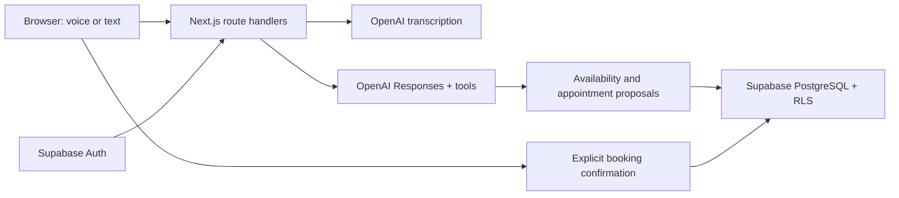

# CareLine Voice AI

A Next.js portfolio demo for a fictional multispecialty clinic. Browser voice and text guide visitors from department selection to a confirmed appointment.

**Live demo:** https://careline-sandy.vercel.app

## Features

- Email/password sign-up, sign-in, sign-out, and display-name editing with Supabase Auth.
- Cardiology, Otorhinolaryngology (ENT), and Dermatology; two fictional physicians per department.
- A single conversational receptionist powered by OpenAI tool calling.
- Push-to-talk, browser speech playback, live transcript, and typed fallback.
- Database-backed availability, explicit confirmation, persistent appointments, and cancellation.
- Row-level security isolates appointments by account. A partial unique index prevents double booking.
- Live AI requires a host-provided access code. Atomic database quotas allow 30 AI/transcription requests per account per UTC day, and 150 across the project. These are request limits, not a guaranteed dollar spending cap.

## Run locally

Requires Node.js 22 or newer.

```sh
npm ci
cp .env.example .env.local
# Fill in your environment variables, then:
npm run dev
```

Open http://localhost:3000. Do not overwrite an existing `.env.local` with configured secrets.

## Environment

| Variable                               | Purpose                                                                  |
| -------------------------------------- | ------------------------------------------------------------------------ |
| `NEXT_PUBLIC_SUPABASE_URL`             | Supabase project URL                                                     |
| `NEXT_PUBLIC_SUPABASE_PUBLISHABLE_KEY` | Public Supabase key; data access is controlled by RLS                    |
| `SESSION_SECRET`                       | Random 32-byte secret for signed booking confirmations                   |
| `OPENAI_API_KEY`                       | Server-side key with available API credit                                |
| `OPENAI_MODEL`                         | Defaults to `gpt-4o-mini`                                                |
| `DEMO_ACCESS_CODE`                     | Private code to unlock paid AI, available in your local environment file |

No Supabase service-role key is required. All app database calls use the signed-in user's JWT. Never expose the OpenAI key or session secret through `NEXT_PUBLIC_` variables.

## Supabase

Hosted project: https://supabase.com/dashboard/project/ofdidlumvcgynpdatpre

The initial, account, and private-function migrations are already applied. For a fresh project, run `supabase/setup.sql`, `supabase/user-accounts.sql`, then `supabase/private-functions.sql` once each. Initial seeding provides two weeks of weekday slots in America/Chicago. To add future slots, run only the slot-insertion section of `setup.sql`; do not rerun the full old bootstrap on an upgraded schema.

Email confirmation remains enabled. In Supabase Authentication → URL Configuration, set the Site URL to your deployed app URL and add its `/auth/callback` URL to the redirect allowlist. Confirm your email, then return to CareLine and sign in. Signup email delivery depends on Supabase's email rate limits and SMTP configuration.

Public users can read clinic data and sanitized slot availability, but cannot read appointment details. The bounded SQL functions for cancellation and quotas explicitly verify `auth.uid()`. The availability function returns no patient data. Their elevated permissions are intentional and restricted to these operations.

## Demo walkthrough

1. Sign up, confirm your email, and sign in.
2. Enter the host-provided demo access code to unlock the AI receptionist.
3. Type a request such as "I would like the earliest Dermatology appointment with Dr. Maya Shah."
4. Continue the conversation, provide a fictional patient name, and review the proposed slot.
5. Click Confirm appointment, then manage or cancel it under My appointments.

Voice input uses browser MediaRecorder and OpenAI transcription; responses use browser speech synthesis. This is push-to-talk, not full-duplex realtime audio. Text input is available throughout. Transcripts remain in memory; audio is not stored in the database. A funded OpenAI API account is required; the app does not silently fall back to scripted replies.

## Architecture



This is a scheduling demo, not a clinical system. It does not diagnose, triage, process real patient information, or connect to an actual clinic. Unclear symptom requests are referred to staff; potential emergencies direct the caller to local emergency services.

## Verification

```sh
npm run typecheck
npm test
npm run build
npx playwright test
```

Browser tests use installed Chrome and a running app. Account tests require `.env.test.local` containing dedicated `TEST_EMAIL`, `TEST_EMAIL_TWO`, and `TEST_PASSWORD`. Live tests require a funded OpenAI key and consume small amounts of API credit. `scripts/test-fixtures.cjs` generates isolated test fixtures for this development database; never seed them into unrelated databases.

## Deployment

The project is deployed on Vercel as `careline` in `yash-jobalias-projects`. Production and preview environment variables have been configured. Run `npx vercel --prod` after changes. No paid Vercel plan is required for this personal demo within Hobby limits. The OpenAI balance is separate.
