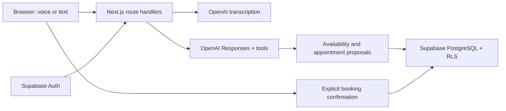

# CareLine Voice AI

A Next.js portfolio demo for a fictional multispecialty clinic. Browser voice and text guide visitors from department selection to a confirmed appointment.

**Live demo:** https://careline-sandy.vercel.app

## Features

- Open guest conversation with Supabase anonymous sessions; no account or access code required to talk.
- AI prepares patient registration from a fictional name and date of birth; an explicit Confirm account button creates the patient account.
- Patient-ID/password login plus existing email accounts, sign-out, and display-name editing.
- Unique appointment references such as AB123, displayed and spoken after confirmation.
- Cardiology, Otorhinolaryngology (ENT), and Dermatology; two fictional physicians per department.
- A single conversational receptionist powered by OpenAI tool calling.
- Hands-free microphone with local speech/pause detection, automatic turn submission, OpenAI Coral voice playback, live transcript, and typed fallback.
- Database-backed availability, explicit confirmation, persistent appointments, and cancellation.
- Row-level security isolates appointments by account. A partial unique index prevents double booking.
- No app-imposed daily request quota or conversation-turn cutoff. Recent messages are sent as a rolling context window. Provider billing, rate limits, and technical request-size limits still apply.

## Run locally

Requires Node.js 22 or newer.

```sh
npm ci
cp .env.example .env.local
# Fill in your environment variables, then:
npm run dev
```

Open http://localhost:3000. Do not overwrite an existing `.env.local` with configured secrets.

## Environment

| Variable                               | Purpose                                                |
| -------------------------------------- | ------------------------------------------------------ |
| `NEXT_PUBLIC_SUPABASE_URL`             | Supabase project URL                                   |
| `NEXT_PUBLIC_SUPABASE_PUBLISHABLE_KEY` | Public Supabase key; data access is controlled by RLS  |
| `SESSION_SECRET`                       | Random 32-byte secret for signed booking confirmations |
| `OPENAI_API_KEY`                       | Server-side key with available API credit              |
| `OPENAI_MODEL`                         | Defaults to `gpt-4o-mini`                              |

No Supabase service-role key belongs in Next.js. Scheduling calls use the visitor's JWT. The register-patient Supabase Edge Function validates that JWT and uses its built-in service-role credential only to register the consenting guest. Never expose the OpenAI key or session secret through `NEXT_PUBLIC_` variables.

## Supabase

Hosted project: https://supabase.com/dashboard/project/ofdidlumvcgynpdatpre

The initial, account, and private-function migrations are already applied. For a fresh project, run `supabase/setup.sql`, `supabase/user-accounts.sql`, then `supabase/private-functions.sql` and the SQL files in `supabase/migrations/` in order. Enable anonymous sign-ins and deploy `supabase/functions/register-patient/index.ts` as `register-patient`. The function validates bearer tokens with getUser; gateway JWT verification is disabled to support the project signing-key configuration. Initial seeding provides two weeks of weekday slots in America/Chicago. To add future slots, run only the slot-insertion section of `setup.sql`; do not rerun the full old bootstrap on an upgraded schema.

Email confirmation remains enabled. In Supabase Authentication → URL Configuration, set the Site URL to your deployed app URL and add its `/auth/callback` URL to the redirect allowlist. Confirm your email, then return to CareLine and sign in. Signup email delivery depends on Supabase's email rate limits and SMTP configuration.

Public users can read clinic data and sanitized slot availability, but cannot read appointment details. The cancellation function explicitly verifies `auth.uid()`. Historical quota tables/functions are retained by the migrations but no longer called by the app. The availability function returns no patient data. Their elevated permissions are intentional and restricted to these operations.

## Demo walkthrough

1. Click Start conversation; no login or access code is required.
2. Provide a fictional name and date of birth when asked. Review and click Confirm account. Declining does not create a patient profile.
3. Save the generated patient ID. For this fictional demo the password is Careline@123, as requested; this is not suitable for real patient data or a production clinic.
4. Describe the reason for the visit. Confirm the suggested specialty and choose a physician and an actual available time.
5. Click Confirm appointment. The assistant provides the server-generated code (two uppercase letters and three digits).
6. Sign back in with the patient ID/password to see the saved code or cancel the appointment.

Temporary anonymous auth sessions exist before registration, but contain no patient profile. Name/date-of-birth are not login credentials. Appointment codes are references, not authentication tokens. Codes are unique and never reused; this format supports 676,000 lifetime references, after which booking fails rather than reusing a code.

Voice input uses browser MediaRecorder and OpenAI transcription; responses use OpenAI gpt-4o-mini-tts with the Coral voice and warm conversational delivery. After one microphone permission prompt, local voice activity detection submits speech after a roughly 1.4-second pause and listens again after each reply. Silence is not sent for transcription. Listening pauses during replies and confirmation screens to prevent echo. Mute or end the call to stop microphone capture. This is hands-free turn-taking, not full-duplex realtime audio; interrupting a spoken reply is not implemented. Text input is available throughout. Transcripts remain in memory; audio is not stored in the database. A funded OpenAI API account is required; the app does not silently fall back to scripted replies.

## Architecture



This is a scheduling demo, not a clinical system. It does not diagnose, triage, process real patient information, or connect to an actual clinic. Unclear symptom requests are referred to staff; potential emergencies direct the caller to local emergency services.

## Verification

```sh
npm run typecheck
npm test
npm run build
npx playwright test
```

Browser tests use installed Chrome and a running app. Account tests require `.env.test.local` containing dedicated `TEST_EMAIL`, `TEST_EMAIL_TWO`, and `TEST_PASSWORD`. Set RUN_LIVE_AI_TESTS=1 to opt into real-model tests. Live tests require a funded OpenAI key and consume small amounts of API credit. `scripts/test-fixtures.cjs` generates isolated test fixtures for this development database; never seed them into unrelated databases.

## Deployment

The project is deployed on Vercel as `careline` in `yash-jobalias-projects`. Production and preview environment variables have been configured. Run `npx vercel --prod` after changes. No paid Vercel plan is required for this personal demo within Hobby limits. The OpenAI balance is separate.

### Scheduling boundaries

The receptionist suggests specialties for scheduling, not diagnoses or treatment. Ambiguous cases go to clinic staff; possible emergency symptoms interrupt routine scheduling. Emergency wording is informed by [NHS shortness-of-breath guidance](https://www.nhs.uk/symptoms/shortness-of-breath/).
